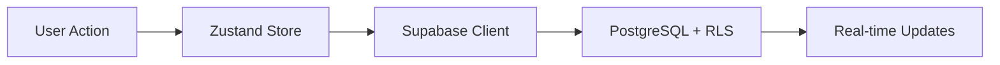

# PrismSplit

<div align="center">
  <!-- Replace with your actual logo or keep text -->
  <h1>💸 PrismSplit</h1>
  <p>
    <strong>Refracting hassle and bringing color to group expenses. Trips, groceries, dinners—everyone picks their items, everyone pays their share. Simple.</strong>
  </p>
  <p>
    <a href="#-tech-stack">Tech Stack</a> • 
    <a href="#-architecture">Architecture</a> • 
    <a href="#-getting-started">Getting Started</a> • 
    <a href="#-contributing">Contributing</a>
  </p>
  
  [](https://opensource.org/licenses/MIT)
  []()
  []()
</div>

<br />

**PrismSplit** is a mobile-first bill splitting app built for speed, transparency, and trust. It features real-time sync with **Supabase PostgreSQL**, secure authentication, and a premium UI experience.

Designed as a **Portfolio Showcase** for modern React Native architecture.

---

## 📱 Showcase

<p align="center">
  
  
  
</p>

## 🛠 Tech Stack

Built with the "Golden Stack" for 2025 mobile development:

| Layer | Technology | Why? |
| :--- | :--- | :--- |
| **Framework** | **Expo SDK 54** (React Native) | Fast iteration, robust native modules, new architecture enabled. |
| **Logic** | **TypeScript** | Strict type safety shared between Frontend & Backend. |
| **State** | **Zustand** | Minimalist, highly performant global state management. |
| **Auth & Storage** | **react-native-encrypted-storage** | Secure auth token storage with Android Keystore/iOS Keychain. |
| **Backend** | **Supabase** (PostgreSQL) | Relational integrity, Row Level Security (RLS), and Realtime subs. |
| **UI System** | **Tamagui** | High-performance styling with compiler optimization. |
| **Validation** | **Zod** | Runtime schema validation for all API inputs. |

## 📐 Architecture

### Supabase-Powered Backend

PrismSplit uses **Supabase** as the primary backend:

1. **PostgreSQL Database**: All data (users, groups, bills, splits) stored with full relational integrity.
2. **Row Level Security (RLS)**: Enforced policies ensure users can only access their own data.
3. **SECURITY DEFINER Functions**: Complex multi-table operations (like group/bill creation) use RPC functions.
4. **Real-time Subscriptions**: (Coming Soon) Live updates when group members make changes.



## ✨ Key Features

- **🔐 Secure Authentication**: Email/password auth with encrypted token storage.
- **👥 Group Management**: Create groups, invite members, manage expenses together.
- **💸 Complex Splitting**: Supports "Equal", "Exact Amounts", "Percentages", and item-level splits.
- **📱 Item-by-Item Selection**: Tap items you consumed, automatically calculates your share.
- **🔐 Row Level Security**: Database policies ensure users can *only* access data they own or share.
- **🎨 Premium UX**: Haptic feedback, fluid animations (Reanimated), and Dark Mode by default.
- **🧾 Receipt Parsing (Planned)**: AI-powered scanning to auto-itemize receipts.

## 🚀 Getting Started

### Prerequisites

- Node.js >= 18
- Java JDK 17 (for Android builds)
- Android Studio with SDK & NDK (for Android)
- Supabase Account (Free Tier)

### 1. Clone & Install

```bash
git clone https://github.com/architagrawal/prismsplit.git
cd prismsplit/Frontend/src
npm install
```

### 2. Supabase Setup

1. Create a new project at [supabase.com](https://supabase.com)
2. Run the schema migration in SQL Editor:
   ```sql
   -- Copy contents from Backend/supabase/migrations/20241223_initial_schema.sql
   ```
3. Note your **Project URL** and **Anon Key** from Settings > API

### 3. Environment Setup

Create a `.env` file in `Frontend/src/`:

```env
EXPO_PUBLIC_SUPABASE_URL=https://your-project.supabase.co
EXPO_PUBLIC_SUPABASE_KEY=your-anon-key-here
```

### 4. Run the App

**Development (Expo Go):**
```bash
npx expo start
```

**Android Device/Emulator:**
```bash
# Set Java 17 (Windows PowerShell)
$env:JAVA_HOME = "C:\Program Files\Java\jdk-17"

npx expo run:android
```

**iOS Simulator:**
```bash
npx expo run:ios
```

## 📁 Project Structure

```
PrismSplit/
├── Frontend/
│   └── src/
│       ├── app/              # Expo Router screens
│       ├── components/       # Reusable UI components
│       ├── lib/
│       │   ├── store/        # Zustand stores (auth, bills, groups)
│       │   └── supabase.ts   # Supabase client config
│       ├── theme/            # Tamagui tokens & themes
│       └── types/            # TypeScript models
└── Backend/
    └── supabase/
        ├── migrations/       # Database schema
        └── functions/        # Edge Functions (planned)
```

## 🔐 Security Notes

- **Never commit `.env` files** - Contains your Supabase keys
- **Anon key is safe for clients** - Row Level Security protects data
- **Service role key is secret** - Never expose in frontend code

## 🤝 Contributing

This project is Open Source under the **MIT License**.
PRs are welcome! Please check `CONTRIBUTING.md` for guidelines.

### Quick Start for Contributors

1. Fork the repo
2. Create a feature branch: `git checkout -b feature/my-feature`
3. Make your changes
4. Test on Android/iOS
5. Submit a PR

## 📄 License

**MIT License** - See [LICENSE](LICENSE) for details.

Copyright (c) 2025-Present Archit Agrawal.

---

<div align="center">
  <p>Built with ❤️ using React Native, Expo, and Supabase</p>
</div>
